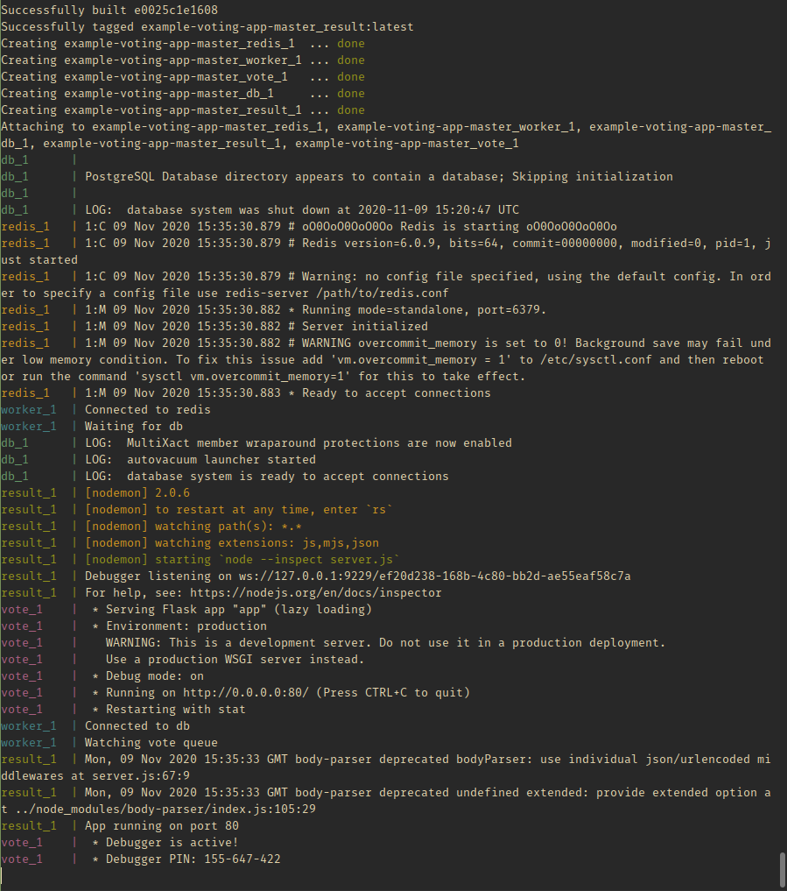
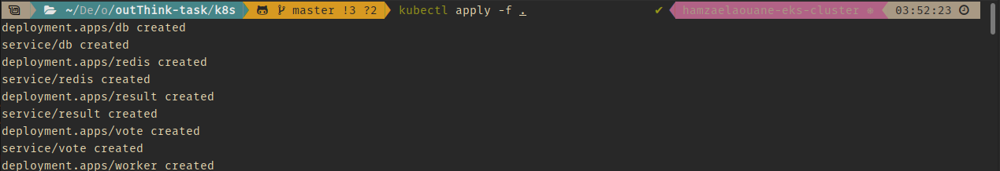

Instavote
=========

Getting started
---------------

Download [Docker for Mac or Windows](https://www.docker.com).

Run in this directory:

    $ docker-compose up

The app will be running at [http://localhost:5000](http://localhost:5000), and the results will be at [http://localhost:5001](http://localhost:5001).

Architecture
-----


* A Python webapp which lets you vote between two options
* A Redis queue which collects new votes
* A Java worker which consumes votes and stores them in…
* A Postgres database backed by a Docker volume
* A Node.js webapp which shows the results of the voting in real time

# STEP 1 - DOCKER-COMPOSE
Before to dive deep in the task, I wanted to make sure that everything was working as expected starting with little steps.
When I run the command:


`docker-compose up`

I faced many problems with the build, problems related to deprecations and syntaxError (with nodemon) and superuser access level (postgres)

The way I went around the nodemon was:
* SynstaxError = update the node dockerfile version to the latest version
* Deprecation = This error was located in Docker-compose.yml in `result` services, I changed:
`command: nodemon --debug server.js` to `command: nodemon --inspect server.js`

One thing that catch my attention was the postgres image did not have any environment variable to authenticate the user and no volume initialized.

For security reason I added those env variable.
```
  db:
    image: postgres:9.4
    volumes:
      - db-data:/var/lib/postgresql/data
    environment:
      POSTGRES_USER: "postgres"
      POSTGRES_PASSWORD: "postgres"
```

But adding an authentication user and a password required me to add a password value in `Worker.js` located in:

`example-voting-app-master/worker/src/main/java/worker` 

and add the password to:

```
while (conn == null) {
        try {
          conn = DriverManager.getConnection(url, "postgres", "postgres") #password goes here;
        } catch (SQLException e) {
          System.err.println("Waiting for db");
          sleep(1000);
        }
      }
```
 All those changes has been made just to do not authorize everyone or `trust` every connection to the db.
 
 now if I run:
 
 `docker-compose up --build`
 
 Everything will be up and running.
 



All this was just to make sure that everything was working and I have less steps to debug eventually if I had any problem with k8s
 
As everything was working just fine at this point, I decided to tag my docker images:
```
example-voting-app-master_worker_1
example-voting-app-master_vote_1 
example-voting-app-master_result_1 

```

and push them to my dockerhub so I could use them for the next step, kubernetes.


# STEP 2 - MINIKUBE
Once I was sure my containers were working fine, I moved to minikube to test those containers on a local kubernetes before pushing everything
to the final step (terraform EKS).

in this project, under the folder k8s, there are all the files necessary to run kubectl:

```
├── db-deployment.yaml
├── db-service.yaml
├── redis-deployment.yaml
├── redis-service.yaml
├── result-deployment.yaml
├── result-service.yaml
├── vote-deployment.yaml
├── vote-service.yaml
└── worker-deployment.yaml

```
 In my k8s I have a deployment file and a service file for each service I used in docker-compose.
 I need the deployment file to keep a set of pods running
 while the service will be responsible for enabling network access to a set of pods.


To try the build, `cd` into `k8s` folder and run the command:

`kubectl create -f .`

this will create all the yaml file inside k8s folder.

once is completed, run the command:

`minikube ip`

and this should give you the IP of your minikube. 

Open your browser and go to:
`<minikupeIP>:31000` for the vote page
`<minikubeIP>:31001` for the result page

and we should be able to see the voting page and the result page.


# STEP 3 - TERRAFORM 

`cd` in `terraform` folder and this is the folder structure:
```
├── iam.tf
├── main.tf
├── outputs.tf
├── quick-access.md
├── sg.tf
├── ssh
│   ├── eks-ssh
│   └── eks-ssh.pub
├── subnets.tf
├── terraform.eks.tfvars
├── terraform.eks.tfvars.git
├── terraform.tfstate
├── terraform.tfstate.backup
└── variables.tf

1 directory, 13 files

```

**EXTREMELY IMPORTANT**: in `main.tf` , `sg.tf` I set the cidr_blocks to be wide open `0.0.0.0/0` for testing purpose. Please consider changing
it to a specific `IP` suitable for the company and testing.

before to run:
`terraform init` or any other terraform command, please take a look to:
`terraform.eks.tfvars`

```
aws_region     = "eu-west-1"
aws_access_key = "<YOUR ACCESS KEY HERE>"
aws_secret_key = "<YOUR SECRET HERE>"
ssh_public_key = "./ssh/eks-ssh.pub"
custom_tags = {
  Name      = "hamzaelaouane-eks-cluster-tag"
  Terraform = "true"
  Delete    = "true"
}

eks-cluster-name   = "hamzaelaouane-eks-cluster"
kubernetes-version = "1.16"

desired_number_nodes = 5
max_number_nodes     = 5
min_number_nodes     = 1

tcp_ports = ["22", "31000", "31001"]
```

This is the file where I store all the placeholders for terraform to spin up correctly.
There is a ssh folder, where you can create a ssh key to log in to the instances.

**commands to use for testing**

inside terraform folder run:

`terraform init`
`terraform plan -var-file terraform.eks.tfvars` to check all the resources that will be created
`terraform apply -var-file terraform.eks.tfvars` to create all resources (will take about 16min to finish


at this point we need to configure our kubectl to connect to our cluster. to do so run the command:

`aws eks --region eu-west-1 update-kubeconfig --name hamzaelaouane-eks-cluster` 

the terminal should return context update arn:

`Updated context arn:aws:eks:eu-west-1:569551094392:cluster/hamzaelaouane-eks-cluster in /home/nayden/.kube/config`


*important* previous command might override the config file in your kube folder. If you want to append the new configuration use --kubeconfig. visit the following link for more info.

`https://docs.aws.amazon.com/cli/latest/reference/eks/update-kubeconfig.html`

Now we should be able to connect to out aws cluster. To make sure, run the command:
`kubectl get pods -A` or 
`kubectl get nodes`

Finally last step, let deploy our pods to aws kubernetes.

`cd` into `k8s` folder and run the command:

`kubectl apply -f .`



this will create and deploy all our services to aws cluster.

lets test it.

`kubectl get nodes -o wide | awk -F" " '{print $1"\t"$7}'`


this will print back all the EC2 instances IPs. take any of them and go to your browser.

`<nodeIP>:31000` for the vote
`<nodeIP>:31001` for the result.


Once done, we can delete all the k8s node.  In k8s folder run the command:

`kubectl delete -f .`

and in terraform we can destroy all the infrastructure with:

`terraform destroy -var-file terraform.eks.tfvars` , `yes` to confirm and wait for it to complete.


Thank you.


